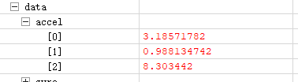

<!-- <script type="text/javascript" src="http://cdn.mathjax.org/mathjax/latest/MathJax.js?config=TeX-AMS-MML_HTMLorMML"></script>
<script type="text/x-mathjax-config">
    MathJax.Hub.Config({tex2jax: { inlineMath: [['$', '$']]}, messageStyle: "none" });
</script> -->

<!-- <b><font size=5 color=red face="华文彩云">华文彩云</font></b> -->
# <b><center><font size=20 face="黑体">加速度计的椭球校准</center></font></b>

<b><center><font size=3 face="TIMES">ZYC 2022.9.9</center></font></b>

- [<b><font size=6 face="黑体">目录</font></b>](#bfont-size6-face黑体目录fontb)

  - [<b><font size=4 face="黑体">问题的提出</font></b>](#bfont-size4-face黑体问题的提出fontb)
  - [<b><font size=4 face="黑体">加速度计的误差模型</font></b>](#bfont-size4-face黑体加速度计的误差模型fontb)
  - [<b><font size=4 face="黑体">椭球模型推导</font></b>](#bfont-size4-face黑体椭球模型推导fontb)
  - [<b><font size=4 face="黑体">椭球拟合</font></b>](#bfont-size4-face黑体椭球拟合fontb)

  - [<b><font size=4 face="黑体">应用</font></b>](#bfont-size4-face黑体应用fontb)
  - [<b><font size=4 face="黑体">实际效果</font></b>](#bfont-size4-face黑体实际效果fontb)
  - [<b><font size=4 face="黑体">总结</font></b>](#bfont-size4-face黑体总结fontb)

  - [<b><font size=4 face="黑体">应用</font></b>](#bfont-size4-face黑体应用fontb)
  - [<b><font size=4 face="黑体">实际效果</font></b>](#bfont-size4-face黑体实际效果fontb)
  - [<b><font size=4 face="黑体">总结</font></b>](#bfont-size4-face黑体总结fontb)
  

---

## <b><font size=4 face="黑体">问题的提出</font></b>

&emsp;&emsp;IMU是一种常用的用于测量物体加速度值、角速度值的惯性传感器，作为物体姿态测量中的重要传感器，我们对其精度具有严格要求。由于IMU型号的差异乃至同一型号由于加工制造误差所造成的差异，使得不同IMU在同一套算法下计算的结果会有所不同，所以IMU在使用前往往会进行校准。对于陀螺仪的校准，我们常用的方法是消除静态误差的方法，即静止状态下多次测量取平均值得到偏移误差，将测量的陀螺仪数据减去静态误差便可得到校准数据。但加速度计却很少使用校准，一方面是因为对于高精度的IMU芯片，其内置的加速度计往往精度很高，不太需要校准，另一方面是加速度计不能使用陀螺仪消除静态误差的方法那样简单地获得误差，所以见到校准方法。但对于低精度的陀螺仪，例如MPU6050，加速度计校准是非常有必要的。下面我举个例子说明。

&emsp;&emsp;以我手中的MPU6050（正点原子版）为例，在静止状态下两个姿态所读取的值为

<div align=center></div>

<div align=center></div>

显然   $\sqrt{10.176^2+0.055^2+0.907^2} = 10.216$ &emsp;$\sqrt{3.186^2+0.988^2+8.303^2} = 8.948$

与实际中的$9.8$相差较大,而且随着陀螺仪的姿态不同读取的数据也不同，所以进行加速度计校准是十分必要的。经过阅读相关文献以及查阅资料，现找到一种较为简单易懂的校准方法————**加速度计椭球校准**。

---

## <b><font size=4 face="黑体">加速度计的误差模型</font></b>

公式:

$$
accx = a_1*accx_m+b_1 
$$

$$
accy = a_2*accy_m+b_2
$$

$$
accz = a_3*accz_m+b_3
$$

* $accx,accy,accz$ : 校准后的加速度值
* $accx_m,accy_m,accz_m$ : 校准前的加速度值
* $a_1,a_2,a_3$ : 比例系数
* $b_1,b_2,b_3$ : 零偏

所以我们共需要求取6个系数才能够完成校准

---

## <b><font size=4 face="黑体">椭球模型推导</font></b>

静止状态下

$$
accx^2+accy^2+accz^2 = g^2
$$

将误差模型代入

$$
(a_1\cdot accx_m+b_1)^2+(a_2\cdot accy_m+b_2)^2+(a_3\cdot accz_m+b_3)^2=g^2
$$

令 $accx_m=x,accy_m = y,accz_m=z$ ,可化为

$$
(\frac{x+\frac{b_1}{a_1}}{\frac{g}{a_1}})^2+(\frac{y+\frac{b_2}{a_2}}{\frac{g}{a_2}})^2+(\frac{z+\frac{b_3}{a_3}}{\frac{g}{a_3}})^2=1
$$

此时令

$$
O_x = -\frac{b_1}{a_1},O_y=-\frac{b_2}{a_2},O_z=-\frac{b_3}{a_3}
$$

$$
R_x = -\frac{g}{a_1},R_y=-\frac{g}{a_2},R_z=-\frac{g}{a_3}
$$

公式化为

$$
(\frac{x-O_x}{R_x})^2+(\frac{y-O_y}{R_y})^2+(\frac{z-O_z}{R_z})^2=1
$$

这便是常见的轴对齐椭球标准方程

<div align=center></div>

也就是说加速度计测量的三个数值满足上述方程，但我们要如何获得椭球方程？这就需要读取不同数据，拟合出椭球方程。下面使用空间二次曲面数据拟合的方法（基于最小二乘法）。

---

## <b><font size=4 face="黑体">椭球拟合</font></b>

以下公式的推导主要参考以下博客

[空间二次曲面数据拟合算法推导及仿真分析_Inspire-CSDN博客](https://blog.csdn.net/hj199404182515/article/details/59480954)

[最小二乘估计及证明_野生猿-群号1025127672-CSDN博客_最小二乘估计](https://blog.csdn.net/qq_31073871/article/details/81067301)

[三维空间中的椭球拟合+磁力计校准算法+加速度计校准算法](https://blog.csdn.net/qq_31073871/article/details/87008583)

展开

$$
(\frac{x-O_x}{R_x})^2+(\frac{y-O_y}{R_y})^2+(\frac{z-O_z}{R_z})^2=1
$$

有

$$
\frac{x^2}{R_x^2}-\frac{2xO_x}{R_x^2}+\frac{O_x^2}{R_x^2}+
\frac{y^2}{R_y^2}-\frac{2yO_y}{R_y^2}+\frac{O_y^2}{R_y^2}+
\frac{z^2}{R_z^2}-\frac{2zO_z}{R_z^2}+\frac{O_z^2}{R_z^2}=1
$$

两边同时乘$R_x^2$

$$
x^2+\frac{R_x^2}{R_y^2}y^2+\frac{R_x^2}{R_z^2}z^2+(-2O_x)x+(-2\frac{R_x^2O_y}{R_y^2})y+(-2\frac{R_x^2O_z}{R_z^2})z+(O_x^2+\frac{R_x^2O_y^2}{R_y^2}+\frac{R_x^2O_z^2}{R_z^2}-R_x^2) = 0
$$

令

$$
A = \frac{R_x^2}{R_y^2}, B=\frac{R_x^2}{R_z^2}, C=-2O_x, D=-2\frac{R_x^2O_y}{R_y^2}
$$

$$
E=-2\frac{R_x^2O_z}{R_z^2},F=O_x^2+\frac{R_x^2O_y^2}{R_y^2}+\frac{R_x^2O_z^2}{R_z^2}-R_x^2
$$

可得

$$
Ay^2+Bz^2+Cx+Dy+Ez+F=-x^2
$$

$$
\left[\begin{matrix}
  y^2 & z^2 & x & y & z & 1
\end{matrix}\right]
\cdot
\left[\begin{matrix}
  A& B& C& D& E & F
\end{matrix}\right]^T = -x^2
$$

令

$$k = \left[
 \begin{matrix}
    y^2 & z^2 & x & y & z & 1
  \end{matrix}
  \right]
$$

$$X = \left[
 \begin{matrix}
    A & B & C & D & E & F
  \end{matrix}
  \right]
$$

$$
Y = -x^2
$$

所以

$$
KX=Y
$$

故X的最小二乘解为

$$
X = (K^TK)^{-1}K^TY
$$

[CSDN最小二乘法的矩阵表达---AHU-丁少侠](https://blog.csdn.net/DY7778F/article/details/122782996)

所以
$$
O_x =-\frac{C}{2},O_y =-\frac{D}{2A},O_y =-\frac{E}{2B}
$$

$$
R_x =\sqrt{O_x^2+AO_y^2+BO_z^2-F},R_y =\sqrt{\frac{R_x^2}{A}},R_z =\sqrt{\frac{R_x^2}{B}}
$$

---

## <b><font size=4 face="黑体">应用</font></b>

打开文件夹中的python文件ACCEL.py
<div align=center></div>

python文件主要实现电脑和STM32板的UART通信，并将读取的数据处理得到结果,该文件包含的包有

````python
import serial
import numpy as np
import struct
````

类的初始化,port表示端口，我的是"COM4"，bsp表示波特率，num表示一个点的采样个数

````python
    def __init__(self,port,bsp,num)
````

初始化后直接调用类内函数

````python
 def Calibration(self):
````

由于加速度计在高速中精度降低，所以读取的每一个数据都是在静止状态下，下面展示实践用法。

* 首先，需要将CH340转串口将电脑与板子的串口连接，然后确定端口号，修改代码中的端口号。我所使用的是芯片为STM32F103C8T6，IMU为MPU6050，STM32只需要读取加速度的值并一直发送就好。**注意，发送的是原数据而不是处理后的，也就是从MPU中直接读到的6个字节，不发送处理后的数据最主要是发送6个字节比发送3个float类型的数据占用带宽更少**
  
<div align=center></div>

* 点击运行代码，输入start便可读取数据，数据个数为所设定的，数据越多则拟合越准。当记录完一个点后，便需要改变陀螺仪的姿态，继续录取其他点，输入start或next都可以，直到记录数据足够多，输入end结束，返回$a_1,a_2,a_3,b_1,b_2,b_3$。
<div align=center></div>

* 将数据放入代码中检测结果
<div align=center></div>
<div align=center></div>

---

## <b><font size=4 face="黑体">实际效果</font></b>

选取三个姿态读取数据

---
<div align=center></div>

---
<div align=center></div>

---
<div align=center></div>

---

分别计算(前一个为原数据，后一个为校准数据)

1. 图一

$$
\sqrt{10.164^2+0.0096^2+0.907^2} = 10.204,\sqrt{9.603^2+0.120^2+2.045^2} = 9.810
$$

2. 图二

$$
\sqrt{3.417^2+0.944^2+8.288^2} = 9.014,\sqrt{2.814^2+1.045^2+9.322^2} = 9.793
$$

3. 图三

$$
\sqrt{(-9.268)^2+0.153^2+(-0.012)^2} = 9.269,\sqrt{(-9.760)^2+0.310^2+1.148^2} = 9.832
$$

---

## <b><font size=4 face="黑体">总结</font></b>

从实际效果中可以看出，校准后的加速度值更贴近于真实的重力加速度。虽然在其他高精度的IMU中所测得的静态加速度计不需要校准，但懂得多一个方法对以后的应用也会有很大的帮助
